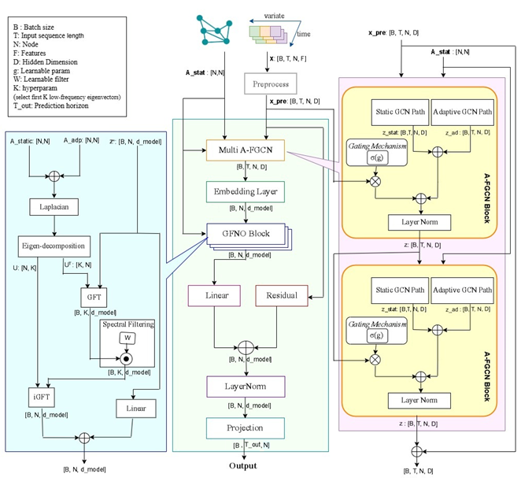

# HG-GFNO Traffic Forecasting (PeMS) — Research Code

This repository contains the research implementation for the paper:

**“Integrated Spatio-Temporal Modeling with Hybrid Graph Convolutions and the Graph Fourier Neural Operator for Traffic Prediction”**

HG-GFNO (**H**ybrid **G**raph Convolutions + **G**raph **F**ourier **N**eural **O**perator) is a unified spatio-temporal forecasting framework for traffic prediction on road networks. It combines:
- **Hybrid static–adaptive graph convolutions** for localized + dynamic spatial learning, and
- **Graph Fourier Neural Operator (GFNO)** for efficient long-range temporal modeling in the graph spectral domain.

> The paper reports consistent improvements on PeMS benchmarks (PEMS03/04/07/08), with notable gains (up to ~10.9% RMSE and ~11.9% MAE reported) over strong baselines, while remaining parameter-efficient and stable.

---

## Table of Contents
- [Highlights](#highlights)
- [Method Overview](#method-overview)
- [Installation](#installation)
- [Datasets](#datasets)
- [Configuration Files](#configuration-files)
- [Training & Evaluation](#training--evaluation)
- [Reproducibility](#reproducibility)
- [Outputs & Logging](#outputs--logging)
- [Results](#results)
- [Citation](#citation)
- [License](#license)
- [Contact](#contact)
- [Acknowledgements](#acknowledgements)

---

## Highlights
- **End-to-end** spatio-temporal modeling (no fragmented spatial/temporal pipeline).
- **Hybrid graph learning**: combines physical topology (static adjacency) + data-driven correlations (adaptive adjacency).
- **Sequence-as-Token** representation: each node’s full historical sequence is embedded as a single token.
- **GFNO spectral-temporal block**: models long-range dependencies without heavy attention/recurrent overhead.
- Evaluated on **PEMS03 / PEMS04 / PEMS07 / PEMS08**.

---

## Method Overview

HG-GFNO follows an end-to-end pipeline:

1) **Multi A-FGCN (Hybrid Static–Adaptive Spatial Encoder)**  
   Two stacked hybrid graph convolution layers with residual connections and normalization:
   - Static path: message passing on the predefined road graph adjacency
   - Adaptive path: learnable adjacency from node embeddings (dynamic correlations)
   - Fusion with gating / residuals improves stability and expressivity

2) **Sequence-as-Token Embedding**  
   Instead of tokenizing time steps, we tokenize each node’s full historical sequence:
   - Input: `Z ∈ R^{B×T×N×D}`
   - Tokens: `Z' ∈ R^{B×N×d_model}` via a learnable linear projection

3) **GFNO Block (Graph Fourier Neural Operator)**  
   GFNO models global dependencies by filtering in the **graph spectral domain**:
   - Build hybrid adjacency `A = A_static + A_adp`
   - Form Laplacian `L`, select Fourier bases (top-K eigenvectors)
   - Apply GFT → spectral filtering → inverse GFT
   - Residual/LayerNorm + final projection to the forecasting horizon

### Architecture Figure





---

## Installation

### Environment

Recommended: Python 3.9+ (tested with 3.10)

Example using conda:

```bash
conda create -n hggfno python=3.10 -y
conda activate hggfno
```

### Dependencies

If you provide a `requirements.txt`:

```bash
pip install -r requirements.txt
```

Minimal starting point (adjust as needed):

```bash
pip install numpy torch matplotlib tensorboardX
```

> GPU training is recommended.

---

## Datasets

We evaluate on four standard traffic benchmarks collected from **Caltrans PeMS**:

* **PEMS03, PEMS04, PEMS07, PEMS08**

PeMS portal:

* [https://pems.dot.ca.gov/](https://pems.dot.ca.gov/)

Common protocol:

* Train/Val/Test split: **60% / 20% / 20%**
* Z-score normalization using **train statistics only**
* Missing values: forward fill + backward fill

### Data Files


This repo expects dataset folders under `data/` (see structure above).

#### Download (Google Drive mirror)
Download the dataset archive from:

- Google Drive: [https://drive.google.com/file/d/1RR0r2yGiWG8h6depT3SBiRsGB4hWb9Hr/view?usp=sharing](https://drive.google.com/file/d/1RR0r2yGiWG8h6depT3SBiRsGB4hWb9Hr/view?usp=sharing)

Then extract it so the folder structure looks like:

```text
data/
  PEMS03/
  PEMS04/
  PEMS07/
  PEMS08/
---

## Configuration Files

All experiments are controlled via `.conf` files in `configurations/`.

Each config typically includes:

* `[Data]`: dataset paths, graph adjacency path, horizon, input length, etc.
* `[Training]`: learning rate, epochs, batch size, model dims, scheduler, early stopping, etc.

> Please check the existing `.conf` templates in `configurations/` and edit paths if necessary.

---

## Training & Evaluation

### 1) Train/Evaluate one dataset configuration

`run.py` supports a `--config` argument (default: `configurations/PEMS08.conf`):

```bash
python run.py --config configurations/PEMS08_mgcn.conf
```

### 2) Run the multi-horizon suite

`run_all.py` runs multiple horizons by generating temporary configs and executing `run.py`.

```bash
python run_all.py
```

---

## Reproducibility

To reproduce paper-level results:

* Keep preprocessing/splits consistent across runs
* Fix random seeds (Python/NumPy/PyTorch)
* Log the exact config used for each run
* Use the same horizon settings reported in the paper (e.g., 12/24/48/96)

Typical (paper) settings include:

* Input sequence length: **192**
* GCN order (K): **2**
* Dropout: **0.15**
* Optimizer: **Adam**
* Loss: **MAE**
* Cosine annealing schedule + warmup
* Early stopping patience: **20**

> Map these settings to the appropriate fields in your `.conf` files.

---

## Outputs & Logging

Experiments are stored under:

```text
experiments/<DATASET>/predict<PRED_LEN>_MGCN_<YYYYMMDD_HHMMSS>/
```

Typical contents:

* training logs (text)
* TensorBoard logs
* checkpoints (`ckpt_best.params`, `epoch_*.params`, etc.)

### TensorBoard

```bash
tensorboard --logdir experiments
```

---

## Results

We report forecasting accuracy using **RMSE** and **MAE** on four PeMS datasets (PEMS03/04/07/08) over
four horizons (**12, 24, 48, 96** steps). **Avg** denotes the average across horizons.
Table 5 compares our model with **Transformer-based** baselines, while Table 6 compares against
**Non-Transformer** baselines (Linear, State Space, and Graph-based models).

<table border="1" cellspacing="0" cellpadding="4">
  <thead>
    <tr>
      <th rowspan="2" align="center">Dataset</th>
      <th rowspan="2" align="center">Metric</th>
      <th colspan="2" align="center">HG-GFNO (proposed model)</th>
      <th colspan="2" align="center">Informer (2021)</th>
      <th colspan="2" align="center">Autoformer (2021)</th>
      <th colspan="2" align="center">FEDformer (2022)</th>
      <th colspan="2" align="center">iTransformer (2023)</th>
    </tr>
    <tr>
      <th align="center">RMSE</th><th align="center">MAE</th>
      <th align="center">RMSE</th><th align="center">MAE</th>
      <th align="center">RMSE</th><th align="center">MAE</th>
      <th align="center">RMSE</th><th align="center">MAE</th>
      <th align="center">RMSE</th><th align="center">MAE</th>
    </tr>
  </thead>
  <tbody>
    <tr>
      <td rowspan="5" align="center">PEMS<br>03</td>
      <td align="center">12</td>
      <td align="center">26.1</td><td align="center">15.4</td>
      <td align="center">36.4</td><td align="center">22.2</td>
      <td align="center">40.8</td><td align="center">26.1</td>
      <td align="center">33.4</td><td align="center">22.4</td>
      <td align="center">27.3</td><td align="center">17.3</td>
    </tr>
    <tr>
      <td align="center">24</td>
      <td align="center">28.9</td><td align="center">17.2</td>
      <td align="center">38.5</td><td align="center">23.9</td>
      <td align="center">54.0</td><td align="center">29.5</td>
      <td align="center">37.3</td><td align="center">25.1</td>
      <td align="center">33.9</td><td align="center">21.5</td>
    </tr>
    <tr>
      <td align="center">48</td>
      <td align="center">32.8</td><td align="center">19.7</td>
      <td align="center">43.2</td><td align="center">26.5</td>
      <td align="center">60.3</td><td align="center">36.9</td>
      <td align="center">44.8</td><td align="center">30.3</td>
      <td align="center">44.7</td><td align="center">28.7</td>
    </tr>
    <tr>
      <td align="center">96</td>
      <td align="center">39.0</td><td align="center">22.8</td>
      <td align="center">48.5</td><td align="center">29.1</td>
      <td align="center">73.0</td><td align="center">45.3</td>
      <td align="center">57.3</td><td align="center">38.5</td>
      <td align="center">50.1</td><td align="center">31.3</td>
    </tr>
    <tr>
      <td align="center">Avg</td>
      <td align="center">31.7</td><td align="center">18.7</td>
      <td align="center">41.7</td><td align="center">25.4</td>
      <td align="center">57.0</td><td align="center">34.4</td>
      <td align="center">43.2</td><td align="center">29.1</td>
      <td align="center">39.0</td><td align="center">24.7</td>
    </tr>
    <tr>
      <td rowspan="5" align="center">PEMS<br>04</td>
      <td align="center">12</td>
      <td align="center">31.1</td><td align="center">19.1</td>
      <td align="center">40.5</td><td align="center">25.6</td>
      <td align="center">45.2</td><td align="center">30.7</td>
      <td align="center">42.9</td><td align="center">29.3</td>
      <td align="center">36.8</td><td align="center">23.3</td>
    </tr>
    <tr>
      <td align="center">24</td>
      <td align="center">33.0</td><td align="center">20.4</td>
      <td align="center">41.7</td><td align="center">26.5</td>
      <td align="center">50.1</td><td align="center">34.8</td>
      <td align="center">50.5</td><td align="center">32.0</td>
      <td align="center">40.3</td><td align="center">26.3</td>
    </tr>
    <tr>
      <td align="center">48</td>
      <td align="center">35.7</td><td align="center">22.1</td>
      <td align="center">42.6</td><td align="center">27.4</td>
      <td align="center">60.1</td><td align="center">41.4</td>
      <td align="center">54.1</td><td align="center">38.0</td>
      <td align="center">47.1</td><td align="center">31.0</td>
    </tr>
    <tr>
      <td align="center">96</td>
      <td align="center">38.1</td><td align="center">23.9</td>
      <td align="center">42.8</td><td align="center">27.6</td>
      <td align="center">65.9</td><td align="center">49.1</td>
      <td align="center">70.1</td><td align="center">50.6</td>
      <td align="center">53.1</td><td align="center">35.2</td>
    </tr>
    <tr>
      <td align="center">Avg</td>
      <td align="center">34.4</td><td align="center">21.3</td>
      <td align="center">41.9</td><td align="center">26.8</td>
      <td align="center">55.4</td><td align="center">39.0</td>
      <td align="center">54.7</td><td align="center">37.5</td>
      <td align="center">44.3</td><td align="center">29.0</td>
    </tr>
    <tr>
      <td rowspan="5" align="center">PEMS<br>07</td>
      <td align="center">12</td>
      <td align="center">34.1</td><td align="center">20.7</td>
      <td align="center">57.4</td><td align="center">33.8</td>
      <td align="center">56.2</td><td align="center">38.1</td>
      <td align="center">43.1</td><td align="center">29.1</td>
      <td align="center">38.1</td><td align="center">24.8</td>
    </tr>
    <tr>
      <td align="center">24</td>
      <td align="center">37.43</td><td align="center">22.6</td>
      <td align="center">58.8</td><td align="center">35.8</td>
      <td align="center">67.0</td><td align="center">46.1</td>
      <td align="center">50.9</td><td align="center">33.7</td>
      <td align="center">45.0</td><td align="center">29.6</td>
    </tr>
    <tr>
      <td align="center">48</td>
      <td align="center">41.5</td><td align="center">25.0</td>
      <td align="center">60.1</td><td align="center">36.5</td>
      <td align="center">70.0</td><td align="center">48.2</td>
      <td align="center">57.3</td><td align="center">38.7</td>
      <td align="center">54.8</td><td align="center">36.2</td>
    </tr>
    <tr>
      <td align="center">96</td>
      <td align="center">45.57</td><td align="center">27.2</td>
      <td align="center">61.2</td><td align="center">37.3</td>
      <td align="center">84.4</td><td align="center">61.1</td>
      <td align="center">66.6</td><td align="center">44.3</td>
      <td align="center">64.9</td><td align="center">43.3</td>
    </tr>
    <tr>
      <td align="center">Avg</td>
      <td align="center">39.6</td><td align="center">23.8</td>
      <td align="center">59.4</td><td align="center">35.7</td>
      <td align="center">69.4</td><td align="center">48.4</td>
      <td align="center">55.2</td><td align="center">37.0</td>
      <td align="center">50.7</td><td align="center">33.6</td>
    </tr>
    <tr>
      <td rowspan="5" align="center">PEMS<br>08</td>
      <td align="center">12</td>
      <td align="center">24.8</td><td align="center">15.4</td>
      <td align="center">46.6</td><td align="center">29.2</td>
      <td align="center">41.6</td><td align="center">28.6</td>
      <td align="center">36.6</td><td align="center">25.0</td>
      <td align="center">28.7</td><td align="center">18.0</td>
    </tr>
    <tr>
      <td align="center">24</td>
      <td align="center">27.7</td><td align="center">17.3</td>
      <td align="center">52.4</td><td align="center">32.3</td>
      <td align="center">47.2</td><td align="center">36.6</td>
      <td align="center">38.2</td><td align="center">27.0</td>
      <td align="center">35.7</td><td align="center">22.6</td>
    </tr>
    <tr>
      <td align="center">48</td>
      <td align="center">30.5</td><td align="center">19.2</td>
      <td align="center">57.3</td><td align="center">37.3</td>
      <td align="center">67.8</td><td align="center">40.0</td>
      <td align="center">48.1</td><td align="center">32.1</td>
      <td align="center">48.6</td><td align="center">31.7</td>
    </tr>
    <tr>
      <td align="center">96</td>
      <td align="center">33.6</td><td align="center">21.1</td>
      <td align="center">60.6</td><td align="center">38.1</td>
      <td align="center">79.5</td><td align="center">51.3</td>
      <td align="center">62.4</td><td align="center">44.2</td>
      <td align="center">57.1</td><td align="center">38.7</td>
    </tr>
    <tr>
      <td align="center">Avg</td>
      <td align="center">29.15</td><td align="center">18.2</td>
      <td align="center">54.2</td><td align="center">34.2</td>
      <td align="center">63.2</td><td align="center">39.4</td>
      <td align="center">48.1</td><td align="center">33.6</td>
      <td align="center">42.5</td><td align="center">27.8</td>
    </tr>
  </tbody>
</table>
<div align="center"><b>Table 5. Performance comparison among Transformer-based models</b></div>

<br>

<table border="1" cellspacing="0" cellpadding="4">
  <thead>
    <tr>
      <th rowspan="2" align="center">Dataset</th>
      <th rowspan="2" align="center">Metric</th>
      <th colspan="2" align="center">HG-GFNO (proposed model)</th>
      <th colspan="2" align="center">Dlinear (2023)</th>
      <th colspan="2" align="center">MambaTS (2024)</th>
      <th colspan="2" align="center">Minusformer (2024)</th>
      <th colspan="2" align="center">MGCN (2025)</th>
    </tr>
    <tr>
      <th align="center">RMSE</th><th align="center">MAE</th>
      <th align="center">RMSE</th><th align="center">MAE</th>
      <th align="center">RMSE</th><th align="center">MAE</th>
      <th align="center">RMSE</th><th align="center">MAE</th>
      <th align="center">RMSE</th><th align="center">MAE</th>
    </tr>
  </thead>
  <tbody>
    <tr>
      <td rowspan="5" align="center">PEMS<br>03</td>
      <td align="center">12</td>
      <td align="center">26.1</td><td align="center">15.4</td>
      <td align="center">40.9</td><td align="center">26.8</td>
      <td align="center">26.2</td><td align="center">16.6</td>
      <td align="center">25.9</td><td align="center">16.4</td>
      <td align="center">29.5</td><td align="center">16.9</td>
    </tr>
    <tr>
      <td align="center">24</td>
      <td align="center">28.9</td><td align="center">17.2</td>
      <td align="center">50.7</td><td align="center">33.5</td>
      <td align="center">32.0</td><td align="center">20.1</td>
      <td align="center">31.3</td><td align="center">19.8</td>
      <td align="center">32.2</td><td align="center">19.2</td>
    </tr>
    <tr>
      <td align="center">48</td>
      <td align="center">32.8</td><td align="center">19.7</td>
      <td align="center">64.3</td><td align="center">38.3</td>
      <td align="center">41.7</td><td align="center">26.4</td>
      <td align="center">41.2</td><td align="center">26.0</td>
      <td align="center">38.7</td><td align="center">22.9</td>
    </tr>
    <tr>
      <td align="center">96</td>
      <td align="center">39.0</td><td align="center">22.8</td>
      <td align="center">75.5</td><td align="center">52.2</td>
      <td align="center">51.2</td><td align="center">33.4</td>
      <td align="center">50.2</td><td align="center">32.4</td>
      <td align="center">42.3</td><td align="center">25.2</td>
    </tr>
    <tr>
      <td align="center">Avg</td>
      <td align="center">31.7</td><td align="center">18.7</td>
      <td align="center">57.9</td><td align="center">38.9</td>
      <td align="center">37.8</td><td align="center">24.1</td>
      <td align="center">37.2</td><td align="center">23.7</td>
      <td align="center">35.7</td><td align="center">21.1</td>
    </tr>
    <tr>
      <td rowspan="5" align="center">PEMS<br>04</td>
      <td align="center">12</td>
      <td align="center">31.1</td><td align="center">19.1</td>
      <td align="center">55.9</td><td align="center">38.2</td>
      <td align="center">35.9</td><td align="center">22.5</td>
      <td align="center">35.3</td><td align="center">22.2</td>
      <td align="center">31.8</td><td align="center">19.7</td>
    </tr>
    <tr>
      <td align="center">24</td>
      <td align="center">33.0</td><td align="center">20.4</td>
      <td align="center">64.5</td><td align="center">44.7</td>
      <td align="center">43.4</td><td align="center">27.6</td>
      <td align="center">42.2</td><td align="center">26.8</td>
      <td align="center">34.3</td><td align="center">21.6</td>
    </tr>
    <tr>
      <td align="center">48</td>
      <td align="center">35.7</td><td align="center">22.1</td>
      <td align="center">77.0</td><td align="center">53.8</td>
      <td align="center">54.2</td><td align="center">35.1</td>
      <td align="center">53.8</td><td align="center">34.8</td>
      <td align="center">37.2</td><td align="center">23.4</td>
    </tr>
    <tr>
      <td align="center">96</td>
      <td align="center">38.1</td><td align="center">23.9</td>
      <td align="center">85.8</td><td align="center">61.2</td>
      <td align="center">66.7</td><td align="center">44.5</td>
      <td align="center">64.7</td><td align="center">41.9</td>
      <td align="center">39.7</td><td align="center">25.1</td>
    </tr>
    <tr>
      <td align="center">Avg</td>
      <td align="center">34.4</td><td align="center">21.3</td>
      <td align="center">70.8</td><td align="center">49.5</td>
      <td align="center">50.1</td><td align="center">32.4</td>
      <td align="center">49.0</td><td align="center">31.4</td>
      <td align="center">35.8</td><td align="center">22.5</td>
    </tr>
    <tr>
      <td rowspan="5" align="center">PEMS<br>07</td>
      <td align="center">12</td>
      <td align="center">34.1</td><td align="center">20.7</td>
      <td align="center">55.1</td><td align="center">38.6</td>
      <td align="center">37.4</td><td align="center">23.3</td>
      <td align="center">36.6</td><td align="center">22.6</td>
      <td align="center">35.1</td><td align="center">21.8</td>
    </tr>
    <tr>
      <td align="center">24</td>
      <td align="center">37.43</td><td align="center">22.6</td>
      <td align="center">70.2</td><td align="center">49.8</td>
      <td align="center">44.6</td><td align="center">28.4</td>
      <td align="center">43.7</td><td align="center">27.1</td>
      <td align="center">38.1</td><td align="center">23.6</td>
    </tr>
    <tr>
      <td align="center">48</td>
      <td align="center">41.5</td><td align="center">25.0</td>
      <td align="center">82.8</td><td align="center">56.5</td>
      <td align="center">57.1</td><td align="center">38.7</td>
      <td align="center">54.8</td><td align="center">34.4</td>
      <td align="center">48.2</td><td align="center">26.6</td>
    </tr>
    <tr>
      <td align="center">96</td>
      <td align="center">45.57</td><td align="center">27.2</td>
      <td align="center">90.5</td><td align="center">79.8</td>
      <td align="center">68.2</td><td align="center">45.0</td>
      <td align="center">68.8</td><td align="center">44.6</td>
      <td align="center">47.8</td><td align="center">30.2</td>
    </tr>
    <tr>
      <td align="center">Avg</td>
      <td align="center">39.6</td><td align="center">23.8</td>
      <td align="center">74.7</td><td align="center">58.7</td>
      <td align="center">51.8</td><td align="center">33.9</td>
      <td align="center">51.0</td><td align="center">32.1</td>
      <td align="center">41.0</td><td align="center">25.6</td>
    </tr>
    <tr>
      <td rowspan="5" align="center">PEMS<br>08</td>
      <td align="center">12</td>
      <td align="center">24.8</td><td align="center">15.4</td>
      <td align="center">47.0</td><td align="center">32.6</td>
      <td align="center">27.4</td><td align="center">17.1</td>
      <td align="center">27.0</td><td align="center">16.1</td>
      <td align="center">24.8</td><td align="center">15.4</td>
    </tr>
    <tr>
      <td align="center">24</td>
      <td align="center">27.7</td><td align="center">17.3</td>
      <td align="center">54.1</td><td align="center">38.0</td>
      <td align="center">33.2</td><td align="center">20.6</td>
      <td align="center">32.6</td><td align="center">20.5</td>
      <td align="center">27.6</td><td align="center">17.2</td>
    </tr>
    <tr>
      <td align="center">48</td>
      <td align="center">30.5</td><td align="center">19.2</td>
      <td align="center">67.8</td><td align="center">48.1</td>
      <td align="center">41.8</td><td align="center">26.4</td>
      <td align="center">42.5</td><td align="center">27.2</td>
      <td align="center">31.3</td><td align="center">19.7</td>
    </tr>
    <tr>
      <td align="center">96</td>
      <td align="center">33.6</td><td align="center">21.1</td>
      <td align="center">77.3</td><td align="center">56.3</td>
      <td align="center">51.0</td><td align="center">33.3</td>
      <td align="center">52.8</td><td align="center">34.1</td>
      <td align="center">34.0</td><td align="center">21.4</td>
    </tr>
    <tr>
      <td align="center">Avg</td>
      <td align="center">29.15</td><td align="center">18.2</td>
      <td align="center">61.5</td><td align="center">43.8</td>
      <td align="center">38.4</td><td align="center">24.4</td>
      <td align="center">38.7</td><td align="center">24.7</td>
      <td align="center">29.4</td><td align="center">18.4</td>
    </tr>
  </tbody>
</table>
<div align="center"><b>Table 6. Performance comparison among Non-Transformer baselines (Linear, State Space, and Graph-based models)</b></div>

### Table 7. Comparison with recent graph-based traffic forecasting models (H=12)

This table reports **short-term** forecasting results (**12-step horizon**) on **PEMS03, PEMS04, and PEMS08**.
Lower **RMSE/MAE** indicates better performance. HG-GFNO achieves the best (lowest) error across all three datasets.

<table border="1" cellspacing="0" cellpadding="4">
  <thead>
    <tr>
      <th rowspan="2" align="center">Model</th>
      <th colspan="2" align="center">PEMS03</th>
      <th colspan="2" align="center">PEMS04</th>
      <th colspan="2" align="center">PEMS08</th>
    </tr>
    <tr>
      <th align="center">RMSE</th><th align="center">MAE</th>
      <th align="center">RMSE</th><th align="center">MAE</th>
      <th align="center">RMSE</th><th align="center">MAE</th>
    </tr>
  </thead>
  <tbody>
    <tr>
      <td align="center">AGCRN</td>
      <td align="center">32.3</td><td align="center">19.4</td>
      <td align="center">32.2</td><td align="center">19.8</td>
      <td align="center">26.4</td><td align="center">16.7</td>
    </tr>
    <tr>
      <td align="center">ASTGCN</td>
      <td align="center">33.3</td><td align="center">20.1</td>
      <td align="center">22.9</td><td align="center">19.4</td>
      <td align="center">35.5</td><td align="center">23.7</td>
    </tr>
    <tr>
      <td align="center">STFGNN</td>
      <td align="center">27.8</td><td align="center">16.5</td>
      <td align="center">32.5</td><td align="center">20.4</td>
      <td align="center">25.1</td><td align="center">15.7</td>
    </tr>
    <tr>
      <td align="center">STG-NCDE</td>
      <td align="center">28.9</td><td align="center">15.6</td>
      <td align="center">31.1</td><td align="center">19.3</td>
      <td align="center">25.4</td><td align="center">15.9</td>
    </tr>
    <tr>
      <td align="center">DDGCRN</td>
      <td align="center">28.5</td><td align="center">17.6</td>
      <td align="center">32.6</td><td align="center">19.2</td>
      <td align="center">26.2</td><td align="center">15.8</td>
    </tr>
    <tr>
      <td align="center"><b>HG-GFNO (proposed)</b></td>
      <td align="center"><b>26.1</b></td><td align="center"><b>15.4</b></td>
      <td align="center"><b>31.1</b></td><td align="center"><b>19.1</b></td>
      <td align="center"><b>24.8</b></td><td align="center"><b>15.4</b></td>
    </tr>
  </tbody>
</table>
<div align="center"><b>Table 7. Performance comparison with recent graph-based traffic forecasting models (12-step horizon).</b></div>

---

## Citation

If you use this repository in academic work, please cite the paper:

```bibtex
@article{hosseini_hg_gfno_traffic_2026,
  title   = {Integrated Spatio-Temporal Modeling with Hybrid Graph Convolutions and the Graph Fourier Neural Operator for Traffic Prediction},
  author  = {Hosseini, Seyed-Majid and Rahmatinia, S. Mozhgan and Hosseini-Seno, Seyed-Amin},
  journal = {Scientific Reports},
  year    = {2026},
  note    = {Accepted for publication}
}

```

---

## License

Add your preferred license (MIT / Apache-2.0) as `LICENSE`.

---

## Contact

For questions or collaborations:

* Name: **Seyed-Majid Hosseini**
* Email: **hosseini.seyedmajid@mail.um.ac.ir**

